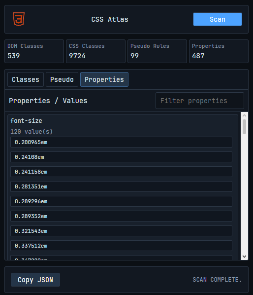

# CSS Atlas

CSS Atlas is a browser extension for analyzing the styling system of the current webpage.

It scans the active tab and extracts:

- DOM classes
- stylesheet classes
- pseudo selectors
- CSS properties and values
- CSS token patterns

## Screenshot

## Features

- Classes tab
- Pseudo tab
- Tokens tab
- JSON export
- Live scan of the current page

## Installation

### Opera / Chrome / Chromium browsers

1. Clone or download this repository
2. Open the browser extensions page
3. Enable **Developer Mode**
4. Choose **Load unpacked**
5. Select the `css-atlas` folder

## Languages

- JavaScript
- HTML
- CSS

## Roadmap

- Overrides / live applicator tab
- CSS variable inventory
- selector frequency analysis
- export reports

## License

MIT
